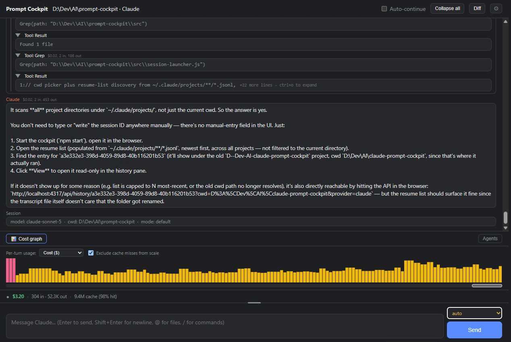

# Prompt Cockpit

A local browser UI for driving a Claude Code or Grok session against a project folder. You pick a provider and a directory, type in the compose box, and the cockpit renders the stream, tool calls, diffs, and a live cost/token strip. It talks to the CLIs over their APIs. It does not wrap a terminal.



## What you need

- **Node.js 18+**
- At least one logged-in coding agent on this machine:
  - **Claude**: [Claude Code](https://docs.anthropic.com/en/docs/claude-code) installed, then `claude login`
  - **Grok**: the `grok` binary on `PATH` (or set `GROK_BIN`), then `grok login`
- The cockpit does not store API keys. It drives whatever login the CLI already has.

The server binds to `127.0.0.1` only. Do not expose it to the network.

## Run

```
npm install   # first time only
npm start
```

Open [http://localhost:4317](http://localhost:4317). Set `PORT` if 4317 is taken (`PORT=4318 npm start`).

## First session

1. Choose **Claude** or **Grok** in the launcher.
2. Point it at a project folder (type a path, pick a recent one, or Browse).
3. Optionally name the session (needed later if another session will `/ask` it) and pick a model. Leave the model on Default to use the CLI's usual one.
4. Click **Start**.
5. Type a prompt and send. Approvals (plan exit, gated tools) show up as a banner above the compose box.

**Resume** lists past sessions for the selected provider. **Start** resumes live; **View** opens the transcript read-only.

A Claude tab and a Grok tab can run at the same time. A session keeps the provider it was started with. You cannot open a Claude transcript as a Grok session, or the other way around.

## Once you are in a session

- **Mode cycle** (Shift+Tab on the compose box, or the mode control) - default / plan / accept-edits and the rest of the CLI's modes.
- **Rewind** on a user turn - opens a new session forked at that point. The original stays. Claude can also revert files when this process started the session fresh. Grok is conversation-only (files on disk stay as they are).
- **`@`** in the compose box - file autocomplete in the project.
- **Cost strip** - spend, tokens in/out, cache hit rate, context used. Grok also has an effort picker instead of Claude's thinking-token budget.
- **`/ask Name: …`** - send a task to another named session in the same folder. The answer comes back as a queued turn.

Settings (gear) covers MCP servers, plugins, permission rules, and UI prefs. On Grok, MCP/plugin toggles go through the Grok CLI (`grok inspect` / `grok mcp` / `grok plugin`) and may need a new session before the agent picks them up.

## Status

MVP1-MVP5 shipped (session in a browser, plan/rewind/`@`/diffs, reconnect, live stats, Grok backend, cross-session `/ask`). MVP6-MVP7 (Windows-hosted sessions over SSH, phone approvals) are not started.

See `tests/README.md` for automated vs hand-verified coverage, and `backlog.md` for open follow-ups.

## License

MIT - see `LICENSE`. Use at your own risk.
