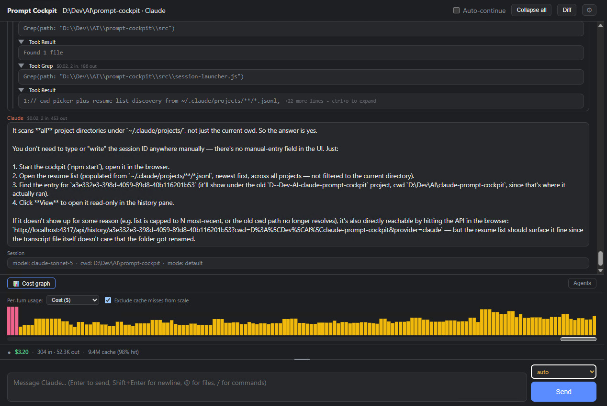

# Prompt Cockpit

A local browser UI for driving a Claude Code, Grok, or Codex session against a project folder. You pick a provider and a directory, type in the compose box, and the cockpit renders the stream, tool calls, diffs, and a live cost/token strip. It talks to the CLIs over their APIs. It does not wrap a terminal.



## What you need

- **Node.js 18+**
- At least one logged-in coding agent on this machine:
  - **Claude**: [Claude Code](https://docs.anthropic.com/en/docs/claude-code) installed, then `claude login`
  - **Grok**: the `grok` binary on `PATH` (or set `GROK_BIN`), then `grok login`
  - **Codex**: the [Codex CLI](https://developers.openai.com/codex/cli/) on `PATH` (or set `CODEX_BIN`) and signed in
- The cockpit does not store API keys. It drives whatever login the CLI already has.

The server binds to `127.0.0.1` only. Do not expose it to the network.

## Run

```
npm install   # first time only
npm start
```

Open the URL printed in the console - `http://localhost:4317/?op=<KEYSTRING>` - not the bare `localhost:4317`. The `op=` value is a per-process operator token; the page reads it once, stores it in `localStorage`, and strips it from the address bar. Without it, `/api/*` calls come back `401`. Set `PORT` if 4317 is taken (`PORT=4318 npm start`).

**If you already have a clone from before 0.1.5:** commit history on `main` was rewritten to scoped-commit messages. Sync with `git fetch origin && git checkout main && git reset --hard origin/main` (rebase or drop any local branches based on the old commits).

## First session

1. Choose **Claude**, **Grok**, or **Codex** in the launcher.
   Claude uses its default login folder automatically (`CLAUDE_CONFIG_DIR` when set, otherwise `~/.claude`). A **Subscription** selector appears only if you configure additional accounts; Cockpit remembers the last choice in this browser.
2. Point it at a project folder (type a path, pick a recent one, or Browse).
3. Optionally name the session (needed later if another session will `/ask` it) and pick a model. Leave the model on Default to use the CLI's usual one. Codex's model list is read live from the CLI, so it reflects whatever that install actually offers; Claude and Grok use a built-in list.
4. Click **Start**.
5. Type a prompt and send. Approvals (plan exit, gated tools) show up as a banner above the compose box.

**Resume** lists past sessions for the selected provider. **Start** resumes live; **View** opens the transcript read-only.

Claude's resume list, model discovery, history, and exports use the selected subscription. A running session keeps that account through reconnect, reset, and rewind; sessions on both accounts can run together. The account is shown in the session header and session list.

## Claude account configuration

Add extra Claude login folders to `~/.prompt-cockpit/settings.json`, alongside
any other Cockpit settings already there. With no `claudeSubscriptions` key,
or an empty array, only the default account is used and there is no selector.
Additional folders are never guessed from their names.

```json
{
  "claudeSubscriptions": [
    { "id": "gmail", "label": "Gmail", "configDir": "~/.claudegmail" }
  ]
}
```

Each entry adds a choice beside **Default**. `id` must be unique (`default`
is reserved); `label` is optional and falls back to the ID. `configDir`
accepts an absolute path, `~/` (or `~\`) for your home folder, or a path
relative to the settings file. Each directory must already have its own
Claude login. Cockpit uses that saved login rather than inherited API keys
or OAuth tokens.

`COCKPIT_SETTINGS_FILE` can point to a different settings file. See
[`cockpit-settings.example.json`](cockpit-settings.example.json) for a complete
example. Refresh the launcher after editing the file; account IDs and folders
used by running sessions should stay in the config until those sessions close.

Tabs using different providers can run at the same time. A session keeps the provider it was started with, and transcripts can only be resumed by their original provider.

## Once you are in a session

- **Mode cycle** (Shift+Tab on the compose box, or the mode control) - default / plan / accept-edits and the rest of the CLI's modes.
- **Rewind** on a user turn - opens a new session forked at that point. The original stays. Claude can also revert files when this process started the session fresh. Grok is conversation-only (files on disk stay as they are). Codex forks through the selected completed turn, including its response; files on disk stay as they are. Codex requires a CLI with `thread/fork.lastTurnId` support.
- **`@`** in the compose box - file autocomplete in the project.
- **Cost strip** - spend, tokens in/out, cache hit rate, context used. Grok and Codex have an effort picker instead of Claude's thinking-token budget.
- **`/ask Name: …`** - send a task to another named session in the same folder. The answer comes back as a queued turn.

Settings (gear) covers MCP servers, plugins, permission rules, and UI prefs. On Grok, MCP/plugin toggles go through the Grok CLI (`grok inspect` / `grok mcp` / `grok plugin`) and may need a new session before the agent picks them up. On Codex, current app-server builds provide native MCP/plugin status and config writes; plugin changes are shown immediately but take effect for a new session.

## Status

MVP1-MVP5 shipped (session in a browser, plan/rewind/`@`/diffs, reconnect, live stats, Grok backend, cross-session `/ask`). Codex is a full third provider as of 0.1.7: rewind, native MCP and plugin controls, live model discovery, and plan quota all work, and its remaining gaps (thinking budget, auto-continue, project-scoped always-allow) are ones the CLI itself does not offer. MVP6-MVP7 (Windows-hosted sessions over SSH, phone approvals) are not started.

See `tests/README.md` for automated vs hand-verified coverage, and `backlog.md` for open follow-ups.

## License

MIT - see `LICENSE`. Use at your own risk.
